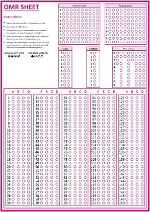

# OMR-Sheet-Evaluation

## Steps to run the service

```
$ git clone https://github.com/swapnanilsharma/OMR-Sheet-Evaluation.git
$ cd OMR-Sheet-Evaluation
$ docker-compose up -d
```

## Sample OMR Sheet



## Request Sample:
```
url = "http://0.0.0.0:8999/exam/v1/omrevaluate"
payload = {'noofquestions': '20', 'answerkey': 'False'}
files = [('imagefile', open('/home/omrPackage/omr-image-processing/images/sample2.jpg','rb'))]
headers = {'Content-Type': 'application/x-www-form-urlencoded'}

import requests
response = requests.request("POST", url, headers=headers, data = payload, files = files)
```

## Response Sample:
```
{
    "result": {
        "status": "OK"
    },
    "student": {
        "name": "Margie Allen",
        "classs": "",
        "section": "",
        "schoolcode": "0918273645",
        "rollno": "0123456789"
    },
    "answers": [
        {
            "questionno": "1",
            "answer": "Z"
        },
        {
            "questionno": "2",
            "answer": "B"
        },
        {
            "questionno": "3",
            "answer": "C"
        },
        {
            "questionno": "4",
            "answer": "D"
        },
        {
            "questionno": "5",
            "answer": "C"
        }
    ],
    "params": {
        "msgid": "",
        "resmsgid": "",
        "err": "",
        "err_msg": "",
        "err_detail": "",
        "status": "OK"
    },
    "responseCode": "OK"
}
```
